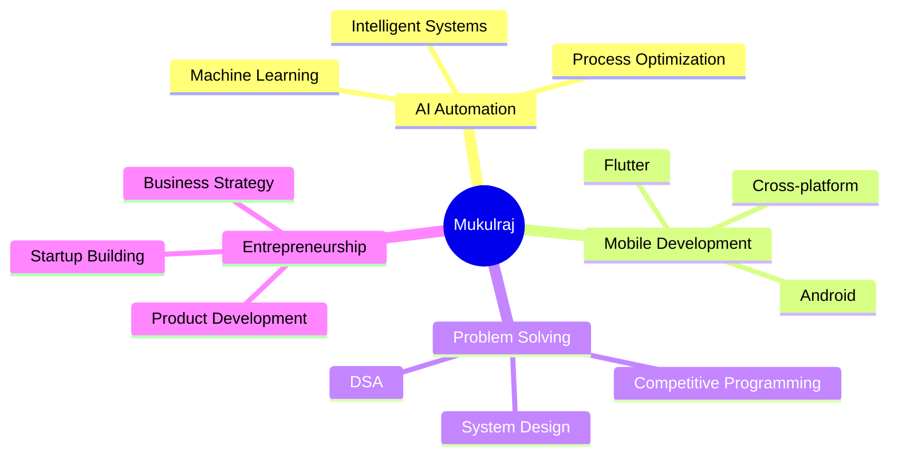

# 🚀 Mukulraj - Software Developer & AI Automation Entrepreneur

<div align="center">
  
[](https://git.io/typing-svg)


[](https://github.com/hi-mukul)
[](https://twitter.com/hi_mukul_)

</div>

---

## 🎯 About Me

> *Building the future with AI automation, one line of code at a time.*

🎓 **Computer Science Student** at Indian Institute of Information Technology (IIIT) Bhagalpur, Bihar  
💼 **AI Automation Startup Founder** - Creating intelligent solutions for business automation  
🔧 **Full-Stack Developer** with expertise in mobile & web technologies  
📊 **Data Structures & Algorithms Enthusiast** - Solving complex problems efficiently  

<div align="center">

### 🌟 Current Focus Areas



</div>

---

## 🛠️ Tech Arsenal

<div align="center">

### Programming Languages


### Mobile & Web Development


### Database & Cloud


### Design & Tools


### Automation & Integration


</div>

---

## 📊 GitHub Analytics

<div align="center">
  


</div>

---

## 🏆 Competitive Programming

<div align="center">

| Platform | Profile | Rating/Level |
|----------|---------|--------------|
| 🍳 **CodeChef** | [@mukulraj7248](https://www.codechef.com/users/mukulraj7248) | ⭐ Active Solver |
| 🚀 **Codeforces** | [@mukulraj7248](https://codeforces.com/profile/mukulraj7248) | 📈 Problem Solver |
| 💚 **HackerRank** | [@mukulraj_2201221](https://www.hackerrank.com/mukulraj_2201221) | 🏅 Certified |
| 🟠 **LeetCode** | [@hi-mukul](https://www.leetcode.com/hi-mukul) | 🔥 Active |
| 🟢 **GeeksforGeeks** | [@hi_mukul](https://auth.geeksforgeeks.org/user/hi_mukul) | 📚 Learning |

</div>

---

## 🎯 What I'm Working On

<div align="center">

```ascii
     🤖 AI Automation Startup
    ┌─────────────────────────┐
    │  • Intelligent Workflows │
    │  • Process Optimization  │
    │  • Business Automation   │
    └─────────────────────────┘
```

</div>

🔥 **Current Projects:**
- Building AI-powered automation solutions for businesses
- Developing intelligent workflow management systems
- Creating mobile applications with ML integration
- Contributing to open-source automation tools

---

## 🌐 Let's Connect

<div align="center">

[](https://linkedin.com/in/hi-mukul)
[](https://twitter.com/hi_mukul_)
[](https://instagram.com/hi_mukul_)
[](https://stackoverflow.com/users/hi-mukul)

📧 **Email:** [mukulraj.2201222cs@iiitbh.ac.in](mailto:mukulraj.2201222cs@iiitbh.ac.in)

</div>

---

<div align="center">

### 💭 Philosophy

*"Innovation distinguishes between a leader and a follower."* - Steve Jobs

**Always learning, always building, always automating.** 🚀


---

⭐ *Feel free to star my repositories if you find them interesting!*

[](https://github.com/hi-mukul)

</div>
